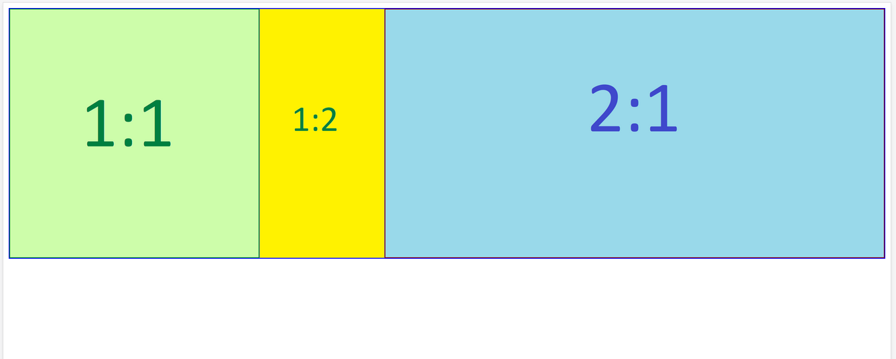
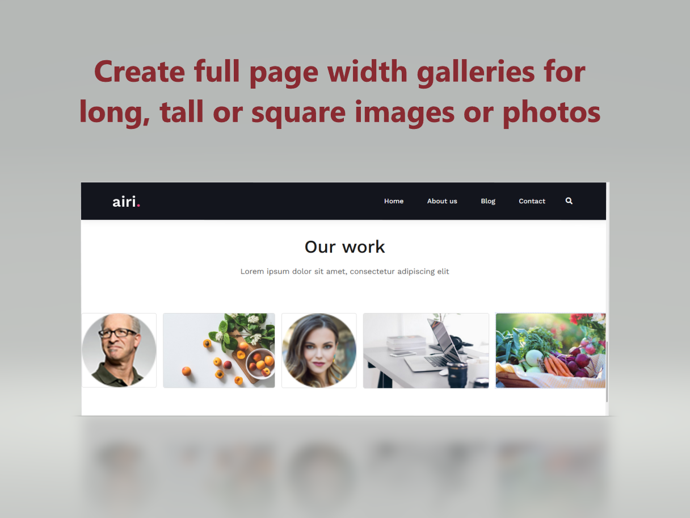
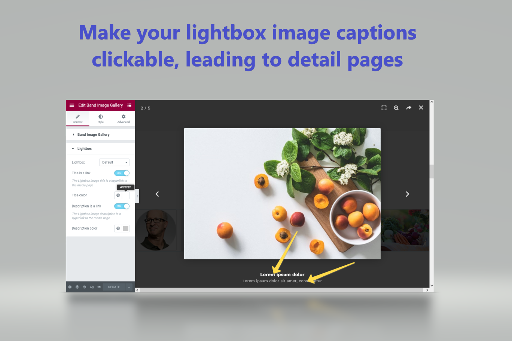
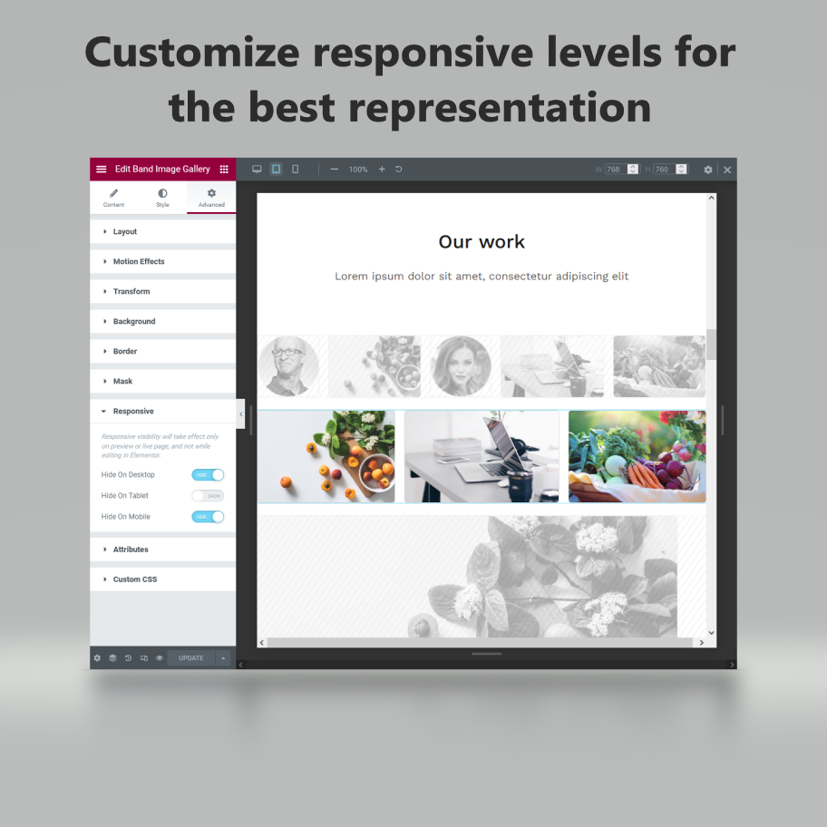

# Elementor Band Gallery Widget Addon 
**Author:** Sergey Beloglazov

**Tags:** gallery, elementor, elementor addon, elementor widgets, addons, proportional gallery, constant aspect gallery, full width gallery

**Requires at least:** 6.0.1

**Tested up to:** 6.0.1

**Requires PHP:** 7.4

**Stable tag:** 1.0.0

**License:** GNU General Public License v3 or later

**License URI:** https://www.gnu.org/licenses/gpl-3.0.html

The Elementor single line (band) gallery widget addon will display images with different aspect ratios with the same height fulfilling the whole page or container width.

# Contents
* [Description](#description)
* [Features](#features)
* [Screenshots](#screenshots)
* [Installation](#installation)
    - [Install with Composer](#install-with-composer)
    - [Install from Zip-archive](#install-from-zip-archive)
    - [Install with WordPress](#install-with-the-wordpress-admin-area)
* [Usage](#usage)
* [License](#license)

# Description 

Display your images with different aspect ratios with the same height fulfilling the whole page or container width using powerful 
and advance **Elementor Band Gallery Widget Addon**.

With this Elementor addon you can create an image gallery with following attributes:

* Images can have different aspect ratios (an image width divided by its height): 1:1, 1:2, 2:3, etc.
* Display image previews in one single slider gallery
* All image previews, displayed in the slider have the same height
* Image preview widths calculates to fulfill the whole page or container width

Your can drop any images to your gallery: vertical, horizontal or square to your slider gallery and it will be displayed as fulfilled band. It will adjust preview sizes to place them side-by-side:

# Features
- **Professional look of gallery of images with different aspect ratios**
You don't need to crop your tall or fill background of wide images anymore. Now your photo galleries or portfolios will look professionally.
- **Active Lightbox captions**
Make title and/or description of a Lightbox zoomed image as links to the detailed page. Say more about your portfolio work or a photo.
- **Responsive gallery**
Images fit any page or device width. Control each responsive level representation.

# Screenshots
1. The Page with a sample gallery made by Elementor Band Gallery Widget Addon

2. Lightbox active captions settings of Elementor Band Gallery Widget Addon and a Lightbox zoomed image sample

3. Using responsive settings for galleries with Elementor Band Gallery Widget Addon

# Requirements
* WordPress 6.0.1 or higher
* PHP 7.4 or higher.

# Installation
## Install with Composer

## Install from Zip-archive

## Install with the WordPress admin area

# Usage

# License
This file is part of Band Gallery Addon For Elementor.

Band Gallery Addon For Elementor is free software: you can redistribute it and/or modify it under the terms of the GNU General Public License as published by the Free Software Foundation, either version 3 of the License, or any later version. 

Band Gallery Addon For Elementor is distributed in the hope that it will be useful, but WITHOUT ANY WARRANTY; without even the implied warranty of MERCHANTABILITY or FITNESS FOR A PARTICULAR PURPOSE. See the GNU General Public License for more details.

Get a copy of the GNU General Public License in <https://www.gnu.org/licenses/gpl-3.0.html>.